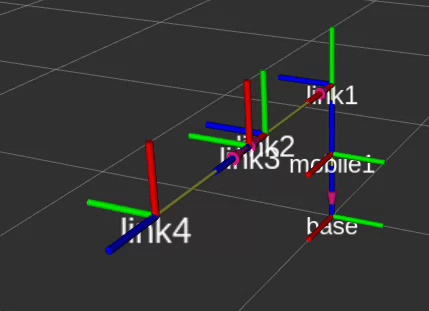

# DH Parameters
Denavit-hartenberg parameters basically defines the frame of reference of all the joint present in the manipulator( In our case a 3-Degree of freedom robot arm).

These are used to describe the orientation of joints of the robot by following some specific rules for assigning joint axes and four variables


Using the DH conventions makes it easier for doing calculations for forward and inverse kinematics.


## Steps to run the demo in RViz 
We will be running the visualization DH-parameters in RViz.

Before that we need to perform some steps.

We have the MARIO repository in the workspace. But, for being able to run the script, we need to have the same in the src folder of the ros2_ws.
* We already have ros2_ws. So now just copy the 2_dh_simulation in the src folder of the ros2_ws. 
```
cp -r /home/(user_name)/MARIO/2_simulation_dh /home/(user_name)/ros2_ws/src
``` 


* Now we need to build the necessary packages and install the necessary ones. So for that
* Go to the ros2_ws by: 
```
cd ros2_ws
```
* then run: 
```
colcon build
```
* Next is to source ros2 

```
source install/setup.bash
```

*  Running the launch file
```
  ros2 launch simulation_dh dh_transformation_visualization.launch.py    
```


<p align="center"></p>
