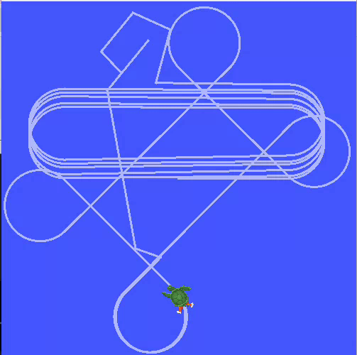

# Drawing a circle using Turtlesim in ROS2

To run this script,first we will copy the turtlesim folder in the src folder of ros2_ws

```
cp -r /home/(user_name)/MARIO/activities/turtlesim /home/(user_name)/ros2_ws/src
```

Now we need to go to the ros2_ws and then build it

```
cd ros2_ws
```

Now to build it Run

```
colcon build
```
Then source it
```
source install/setup.bash
```
To make a circle first we need to open turtlesim_node so run
```
ros2 run turtlesim turtlesim_node
```
Then we need to `open other terminal` and source it
```
source install/setup.bash
```
Then Run
```
ros2 run circle draw_circle.py
```
#Assingment
Move turtle in a way that it avoids hitting the wall(it takes a U-turn when it approache the wall)

<p align="center">
  
</p>